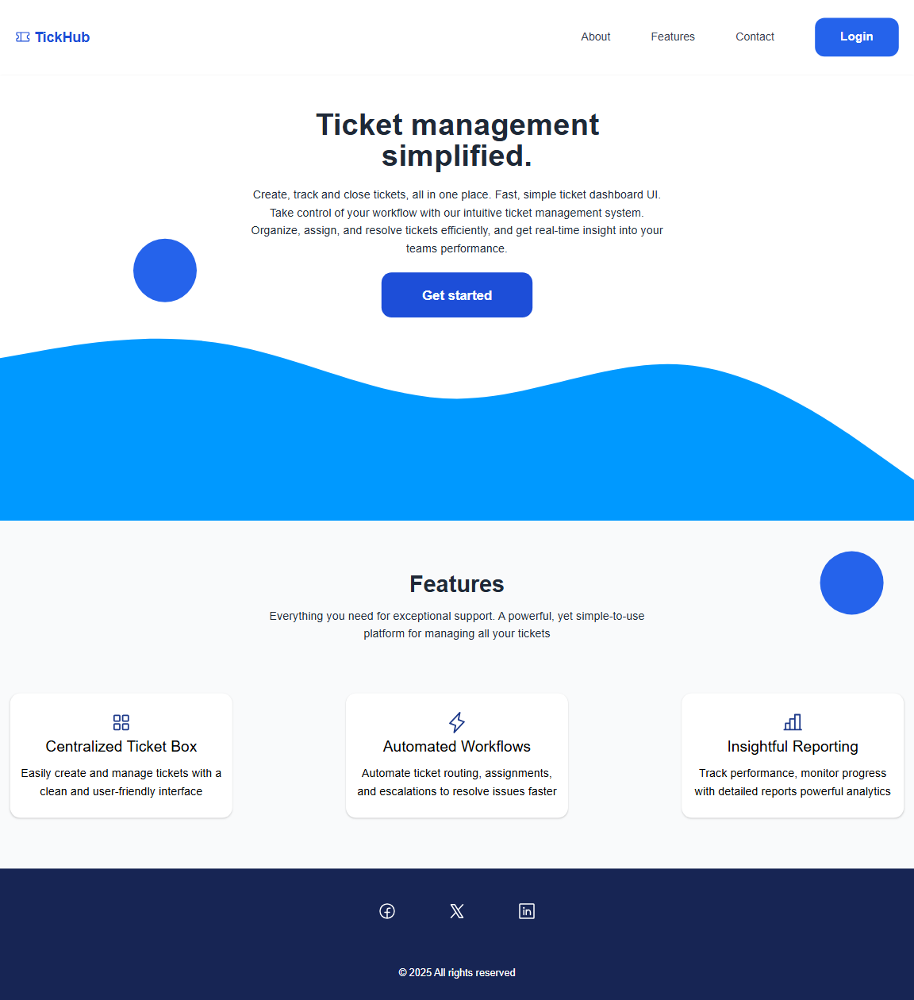
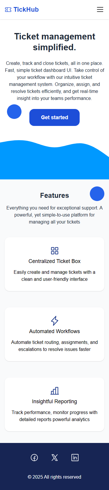
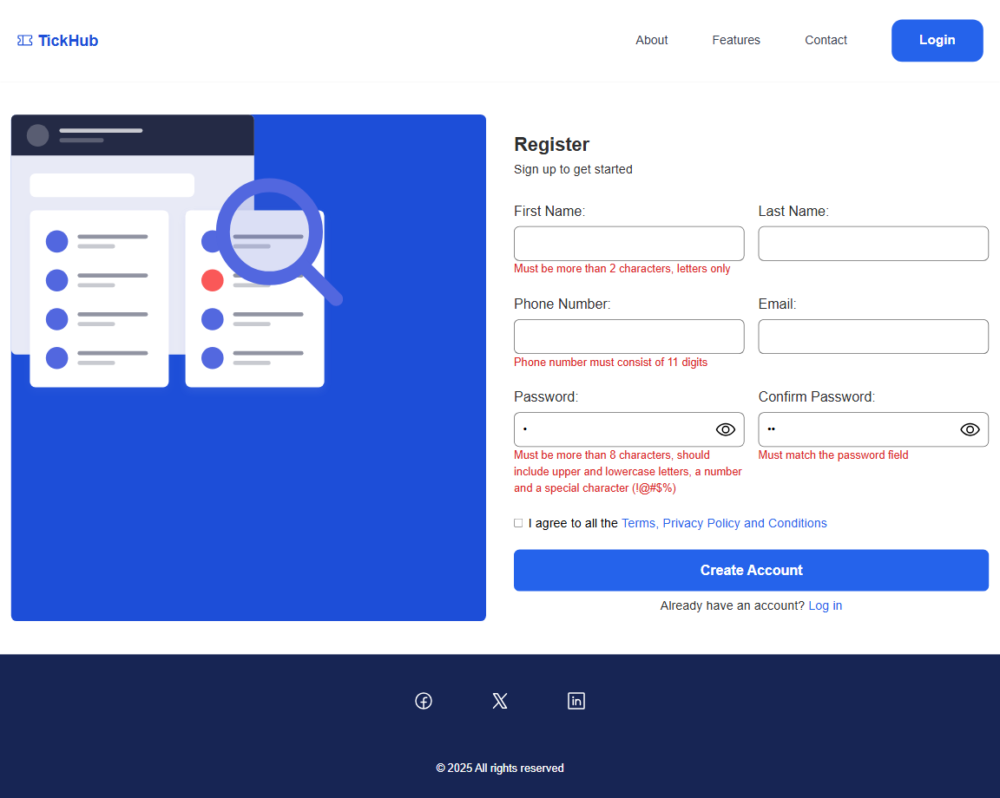
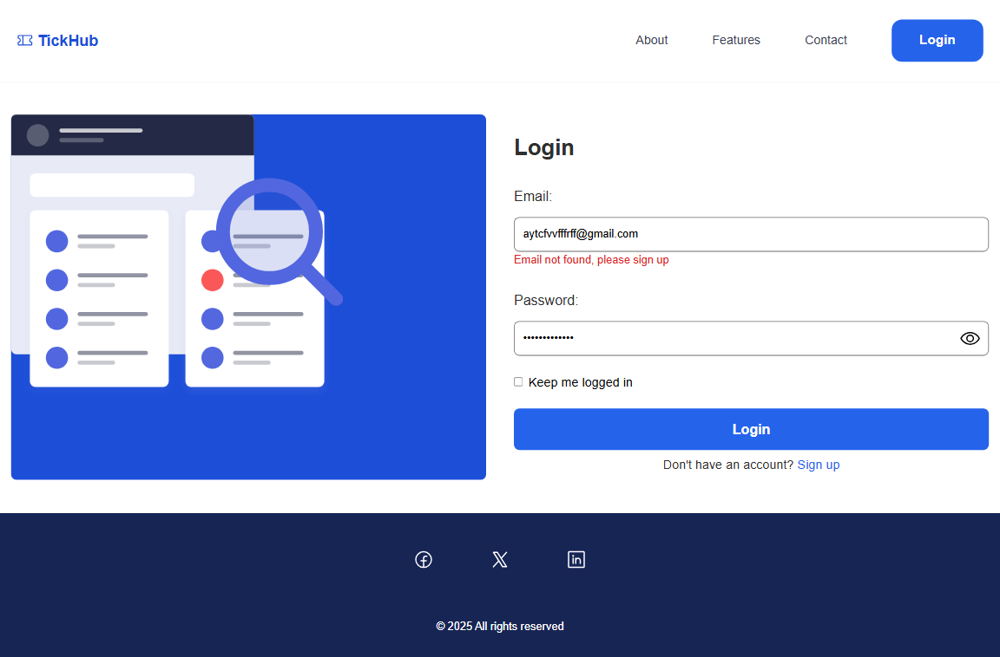
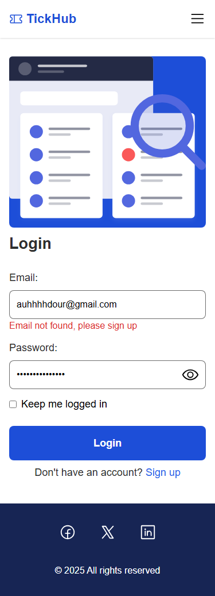
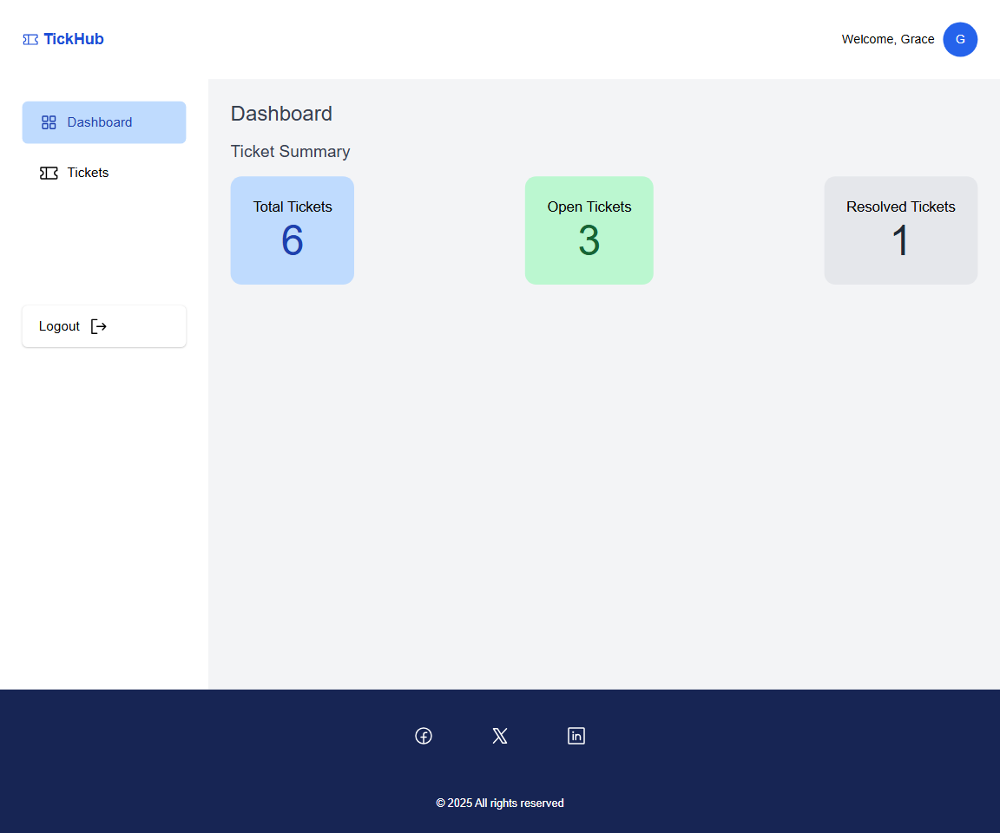
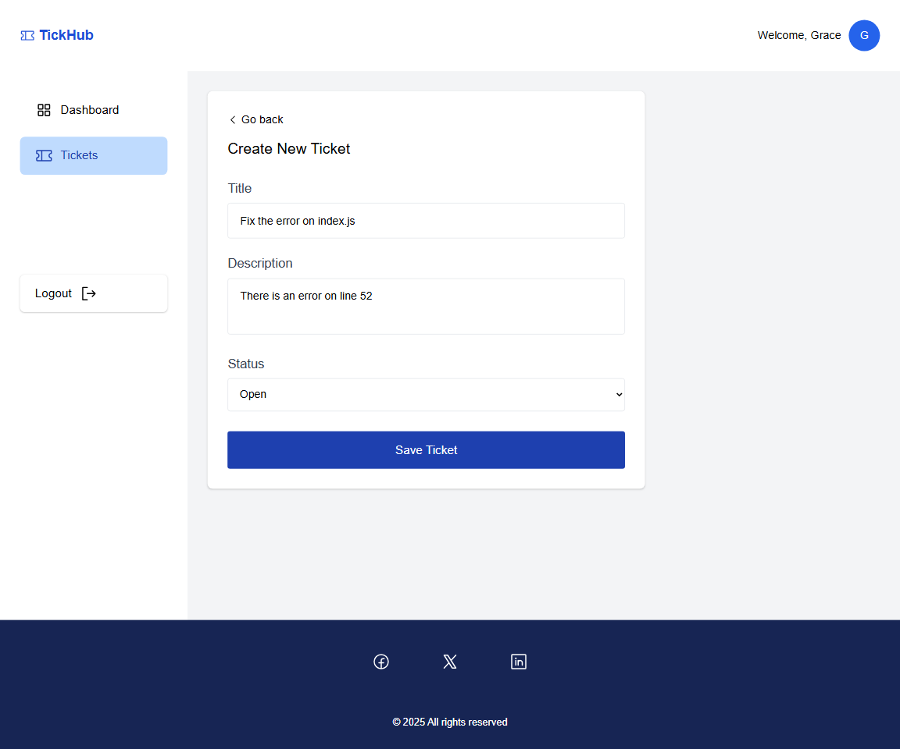
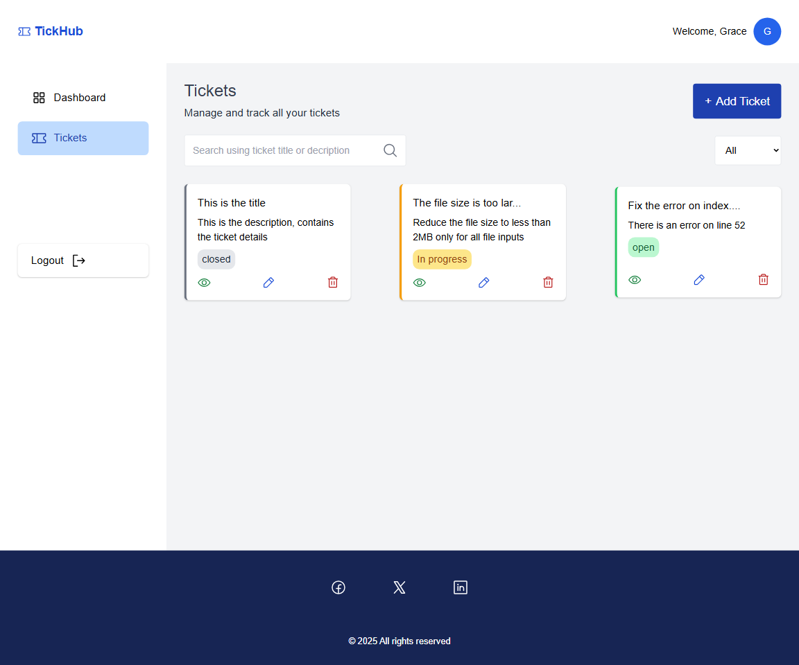
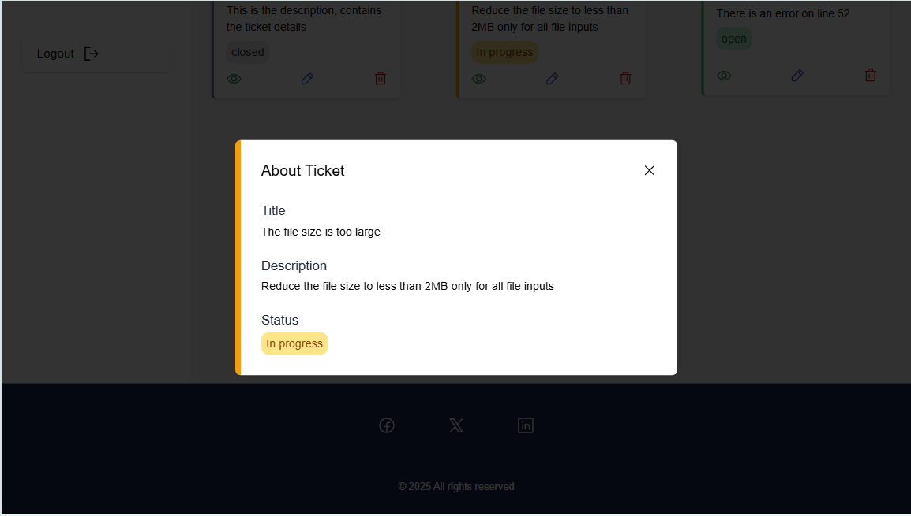

# HNG Internship 13 Stage 2 Task: Build a Multi-Framework Ticket Management Web Application
# This is the Vue.js implementation

## Table of contents

- [Overview](#overview)
  - [Task instructions](#task-instructions)
  - [Screenshot](#screenshot)
  - [Links](#links)
- [My process](#my-process)
  - [Built with](#built-with)
  - [Features](#features)
- [Installation & Usage](#features)
- [Author](#author)


## Overview

This project builds a robust Ticket Management Web Application using three distinct frontend technologies: React, Vue.js, and Twig (each in a separate, complete implementation).

### Task instructions
Every version of the app must deliver a seamless user experience, including a welcoming landing page, a secure authentication process, a high-level dashboard, and a full-featured screen for managing tickets (Create, View, Edit, Delete).
This task is designed to test your mastery in structuring frontend applications, state management, form logic, and UI design consistency across multiple frameworks — while enforcing a uniform layout and design language in all implementations.


Task Instructions
Core Features You Must Deliver
1. Landing Page
 Clearly present the app’s name, a catchy description, and Call-to-Action buttons ("Login" and "Get Started").
 The hero section must include a wavy background, implemented via SVG or CSS clip-path.
 Include decorative circles (at least one in the hero) and box-shaped sections (for features or content) with shadows and rounded corners.

2. Authentication Screen
 Build Login and Signup pages with form validation.
 Provide inline error messages and toast/snackbar notifications for failed logins or invalid credentials.
 On successful authentication, redirect users to the Dashboard.
 Authentication should be simulated using localStorage, a mock API, or a JSON server token system.

3. Dashboard
 Display summary statistics, e.g.:
 Total tickets
 Open tickets
 Resolved tickets
 Add a visible Logout button that clears the session and redirects to the Login screen.
 Must follow the same visual structure and container width rule (max-width: 1440px, centered layout).

4. Ticket Management Screen (CRUD)
 Implement a fully functional Ticket Management page with:
 Create: Form to create new tickets.
 Read: Display a list of existing tickets using card-style boxes with status tags.
 Update: Edit existing ticket details with form validation.
 Delete: Allow users to remove tickets with a confirmation step.

 Authentication simulation must use localStorage with a key name: ticketapp_session.
 Unauthorized users attempting to access restricted routes must be redirected to /auth/login.

 Layout and Design Consistency Requirements
 These design rules must be identical across React, Vue.js, and Twig versions.
 Max Width: Content must be centered with a max-width: 1440px on large screens.
 Hero Section: Includes a wavy SVG background at the bottom edge.
 At least one decorative circle (CSS or SVG) must overlap the hero section.


Color & Status Rules:
 open → Green tone
 in_progress → Amber tone
 closed → Gray tone

 
Acceptance Criteria
 Your work must:
 Use the exact same layout (wave hero, circles, boxes, max-width 1440px) across all frameworks.
 Enforce authentication and protected routes with session tokens.
 Implement complete ticket CRUD with validation and clear feedback.
 Use consistent error handling

## My process

### 🛠️ Built with
- **VueJs 3**  
- **Component API**
- **Tailwind CSS** 
- **Phosphor Icons** 
- **Git and Github**
- **Local Storage**
- **Accessibility**


### 🎨 Features
- A welcoming Landing Page
- Authentication Screens for registration and login with real-time validation
- Dashboard for displaying ticket statistics
- Ticket Management Screen (CRUD)
    Create: Form to create new tickets.
    Read: Display a list of existing tickets using card-style boxes with status tags.
    Update: Edit existing ticket details with form validation.
    Delete: Allow users to remove tickets with a confirmation step.
- Protected routes
- Search and filter features
---

## 📦 Installation & Usage

1. **Clone or download** this repository:
   ```bash
   git clone https://github.com/Austinet/tickhub-vue.git
2. Install dependencies
    ```bash
    npm install
3. Start server
    ```bash
    npm run dev

### Screenshot

-
-
-
-
-
-
-
-
-

### Links
- Solution URL: [Github Repo](https://github.com/Austinet/tickhub-vue.git)
- Live Site URL: [Github Pages](https://tickhub-vue.netlify.app)


## 💬 Author
- Portfolio 🌐 - [Udhe Austine Ogaga](https://austinet-portfolio.netlify.app)
- X/Twitter - [@udhe.austine](https://www.x.com/austineudhe)
- Linkedin - [Udhe Austine Ogaga](https://www.linkedin.com/in/udhe-austine-ogaga)
